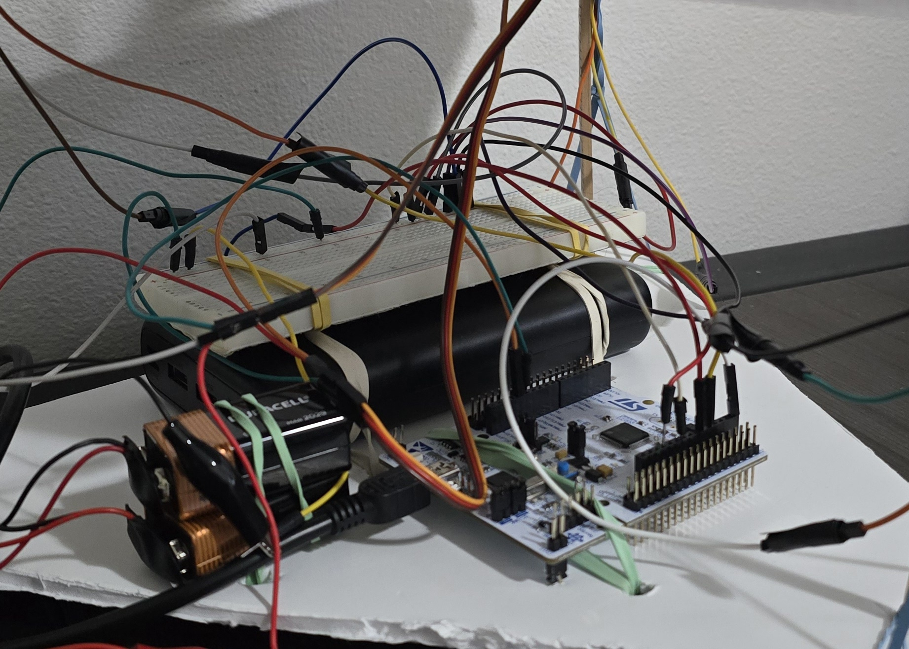

# Sound Tracker

# Overview

This project incorporates embedded programming and digital signal processing to determine the direction a sound is coming from and then point in that direction.

three microphones are spaced a foot apart and used to sample sounds moving across their positions. A microcontroller is programmed to use ADC to record the moment each mic hears the same sound. The microcontroller uses the time delay to calculate which direction the sound is coming from. The microcontroller then sends PWM signals to two servo motors to point toward the direction of the sound. Trigonometry and some vector math is used for the calculations.

Please take a look at the following videos to see the sound tracker in action, and learn more about how it works.

[Project Demo Video](https://us06web.zoom.us/rec/share/T9Xz0FrRPvxkhcv60aODjdxWe40SnZMi_lDHw85-8mUrFeTSWxbZFO6tuQ4ZhbEq.xhWSciTbqP5aoJIy)

[Technical Explanation Video](https://us06web.zoom.us/rec/share/ZUOHpPJSqaJnmVIxaSiPQZ1u4LGBCKlCV0tkxsrGsRDWpTslkaNK5rHOhUaQ-_wH.ihBy98ERrnt02RIg)

# Challenges
The most challenging part was getting the ADC to work. I started by using callbacks, but ran into problems with one callback not being triggered as frequently as the others due to limited resources. I corrected this with a round robin approach, reconfiguring ADC channels and callbacks with every iteration. This approach ensured that every ADC channel got a turn, but it ended up being too slow to keep up with the speed of sound. I ended up just polling each mic in the main while loop. The while loop moved quickly enough to sample accurately in micro seconds, and each mic was sampled with every iteration. This worked very well.

Another challenge I had was writing fast enough code to keep up with the speed of sound. I had to remove all print statements while debugging, because the printf function was too slow. I also had to simplify the while loop. No calculations are done until every mic has heard a sound. This ensures that nothing distracts the cpu from polling the microphones.

# Development Environment

The microprocessor is an stm32 L47RGTx Nucleo board. The stm32CubeIDE was used to configure the board.

This project was programmed in C and compiled into ARM32 Assembly.

The microphones are MAX9814 from Electret

the motors were SG90 9g Micro Servos from Beffkkip

# Configuration
Figure 1 shows the schamatic for the project: 

Figure 2 shows a screenshot of the stm32CubeIDE GUI used to configure the board for analog and PWM input and output: 

Figure 3 shows the microcontroller and wiring

Figure 4 shows the complete device

# Useful Links

- [Microphones on Amazon](https://www.amazon.com/dp/B0B7SP6GYX?ref=ppx_yo2ov_dt_b_fed_asin_title)

- [Servo motors on Amazon](https://www.amazon.com/dp/B07MLR1498?ref=ppx_yo2ov_dt_b_fed_asin_title&th=1)

- [STM32 website](https://www.st.com/en/evaluation-tools/nucleo-l476rg.html)

# Future Work
Get bigger motors, attach a toy nerf gun, and have it shoot my roommates when they get too loud.

